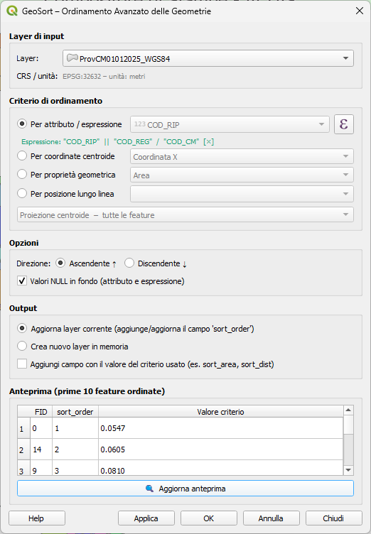

# GeoSort – Advanced Geometry Sorting

[🇮🇹 Italiano](README.md) | 🇬🇧 **English**

[](https://github.com/pigreco/geosort/releases)
[](#languageslingue)
[](#requirements)
[](LICENSE)
[](https://github.com/pigreco/geosort/actions/workflows/tests.yml)

---

QGIS plugin to sort vector layer features by geometric and attribute criteria,
with automatic assignment of a progressive field (default `sort_order`, name/
starting value/step all customizable).

Compatible with **QGIS 3.16+** (Qt5 / PyQt5) and **QGIS 4.x** (Qt6 / PyQt6).



---

## Features

| Criterion | Geometry Types | Description |
|---|---|---|
| Attribute / Expression | All | Sort by the value of any field (String, Int, Double, Date) |
| Centroid Coordinates X / Y | All | Sort by the geographic position of the centroid |
| Distance from Reference Point | All | Euclidean distance of centroid from a configurable point (default origin 0, 0) |
| Area | Polygons | Surface area of the geometry |
| Perimeter | Polygons | Length of the perimeter |
| Length | Lines | Total length of the line |
| Vertex Count | All | Count of vertices in the geometry |
| Bounding Box | All | Width, height, area, Xmin, Ymin of the bounding box |
| Distance from Line | All | Perpendicular distance from a reference line (two modes: centroid or element) |
| Position along Line | All | Projection of centroid onto a reference line (three modes) |
| QGIS Expression | All | Sort by the result of an arbitrary QGIS expression |
| **Multi-criteria (hierarchical)** | All | Secondary criterion to break ties of the primary one (e.g. region → area) |

> **Robustness:** features with NULL/empty geometry and mixed-geometry layers no longer
> cause errors — features that cannot be sorted spatially are pushed to the end.

> **Selected features only:** sorting can be limited to the selected features, both
> in the dialog (*Sort only selected features* checkbox) and in Processing (QGIS
> native checkbox on the input layer). In *Update current layer* mode the
> `sort_order` field is written only for those features.

### Geodesic measurement (geographic CRS)

On layers with a geographic CRS (e.g. EPSG:4326) planar area and length measurements are
expressed in degrees² — metrically meaningless and potentially misleading at high latitudes.
GeoSort solves this by measuring **area, perimeter, length and distances on the ellipsoid**
(geodesic measurement, results in m² or m).

| Mode | Behaviour |
|---|---|
| **Auto** (default) | Geodesic enabled automatically on geographic CRS; planar on projected CRS. A non-blocking warning signals automatic activation. |
| **Always** | Geodesic always active, regardless of CRS. |
| **Never** | Always planar, regardless of CRS. |

The **bounding box** and **position along line** criteria always remain planar (bounding box
is a concept in native coordinates; position along line is monotonic and scale-invariant).

### Multi-criteria sorting

You can set a **secondary criterion** that breaks ties of the primary one. Typical example:
sort by *region* (ascending) and, within the same region, by *area* (descending). Each level
has its own direction. Available both in the dialog (**Secondary criterion** dropdown) and in
Processing (`SECONDARY_*` parameters). Not available when the primary criterion is line-based.

### Text Sorting Modes

For **Attribute** and **QGIS Expression** criteria, you can choose between two modes:

| Mode | Behavior | Example |
|---|---|---|
| **Lexicographic** (default) | Character-by-character comparison | `"1010"` < `"11"` < `"1111"` |
| **Natural Sort** | Digit sequences are compared as integers | `"11"` < `"1010"` < `"1111"` |

Natural Sort is useful with concatenation expressions (e.g. `"fid" || "id_poly"`)
or with alphanumeric fields like `FILE1`, `FILE2`, `FILE10`.

### Custom Numbering

The progressive field is configurable along three axes, both in the dialog and in Processing:

| Parameter | Default | Example |
|---|---|---|
| Field name | `sort_order` | `rank`, `order` — if the field already exists on the layer, it is overwritten instead of duplicated |
| Starting value | `1` | `0` for zero-based numbering |
| Step | `1` | `10` → `10, 20, 30…`, to leave room for future insertions |

---

## Installation

1. Download the plugin `.zip` file
2. In QGIS: **Plugins → Manage and Install Plugins → Install from ZIP**
3. Select the `geosort.zip` file
4. The plugin will be available in the **Vector → GeoSort** menu

---

## Usage

1. Load a vector layer into your QGIS project
2. Open **Vector → GeoSort → GeoSort – Sort Features**
3. Select the input layer and sorting criterion
4. Choose the direction (Ascending / Descending)
5. Use the **Preview** button to verify the result
6. Press **OK** to apply or **Apply** to keep the dialog open

The progressive field (default `sort_order`, customizable — name, starting value,
step) is added/updated on the layer (or on a new in-memory layer, if the
corresponding option is selected).

---

## Processing Toolbox

GeoSort is also available in QGIS Processing Toolbox:
**Toolbox → GeoSort → Sort Features (GeoSort)**

This allows you to use it in batch processing, the graphical modeler, and headless PyQGIS:

```python
import processing
result = processing.run("geosort:geosort_sort", {
    'INPUT': layer,
    'CRITERION': 0,          # 0 = Attribute
    'ATTRIBUTE_FIELD': 'region',
    'DIRECTION': True,        # True = Ascending
    'NULLS_LAST': True,
    'NATURAL_SORT': False,   # True = Natural Sort (digits as numbers)
    # Secondary criterion (tie-break): 0 = none, 1 = attribute, 2 = expression,
    # 3 = centroid X, 4 = centroid Y, 5 = area, ...
    'SECONDARY_CRITERION': 5,    # 5 = Area (polygons)
    'SECONDARY_DIRECTION': False,  # False = Descending
    'ADD_VALUE_FIELD': False,
    # Custom numbering (advanced, all optional):
    'START': 0,               # default 1
    'STEP': 10,                # default 1 → 0, 10, 20, 30...
    'ORDER_FIELD': 'rank',    # default 'sort_order'
    'OUTPUT': 'memory:'
})
output_layer = result['OUTPUT']
```

> The secondary criterion is ignored when the primary criterion is line-based
> (`line_position` / `line_distance`).

For the `centroid_dist` criterion (index `3`, distance from centroid) you can
provide a reference point other than the origin via the `REF_POINT` parameter
(optional, `"x,y [EPSG:xxxx]"` string or `QgsPointXY`):

```python
result = processing.run("geosort:geosort_sort", {
    'INPUT': layer,
    'CRITERION': 3,                          # centroid – distance
    'REF_POINT': '500000,4649776 [EPSG:32633]',
    'DIRECTION': True,
    'OUTPUT': 'memory:'
})
```

To sort only the selected features from PyQGIS:

```python
from qgis.core import QgsProcessingFeatureSourceDefinition
result = processing.run("geosort:geosort_sort", {
    'INPUT': QgsProcessingFeatureSourceDefinition(layer.id(), selectedFeaturesOnly=True),
    'CRITERION': 1,
    'OUTPUT': 'memory:'
})
```

---

## Languages / Lingue

GeoSort supports **Italian** and **English** with complete translations. The language is 
automatically detected from your QGIS system configuration — no user intervention required.

Translations are provided in both source (`.ts`) and compiled (`.qm` binary) formats, 
enabling instant loading without compilation dependencies.

### Adding a new language

The `.ts` files **must not be hand-edited**: they are generated by `scripts/gen_ts.py`, the
single source of truth that extracts every `self.tr()` string from the code and rewrites
both `i18n/geosort_*.ts` files fully synced and well-formed.

```bash
# 1. Add the translations to the generator map in scripts/gen_ts.py
#    (the EN dict for English; for a new language add an XX map
#     and a build('xx', XX) call)

# 2. Regenerate the .ts files (IT and EN always kept in sync)
python3 scripts/gen_ts.py

# 3. (Optional) Compile the .qm files for distribution
lrelease i18n/geosort_*.ts
```

The plugin automatically detects compiled `.qm` files; if not available, it loads `.ts`
files as a fallback.

---

## Requirements

- QGIS ≥ 3.16 LTR or QGIS 4.x
- Python ≥ 3.9
- No external dependencies (only PyQGIS API and Python standard library)

---

## Qt5 / Qt6 Compatibility

The plugin uses standard PyQGIS APIs and does not directly depend on Qt5 or Qt6.
Adaptation to QGIS 4 / PyQt6 includes:

- Qualified enums (`QgsWkbTypes.GeometryType.PointGeometry` instead of `QgsWkbTypes.PointGeometry`)
- `QMetaType.Type` instead of `QVariant.Type` for field definitions
- `exec()` instead of `exec_()` for modal dialogs (deprecated in PyQt6)

No modifications are required for end users: the same `.zip` file works
on both QGIS versions.

---

## Testing

Core sorting logic tests do not require QGIS:

```bash
cd geosort
python -m unittest tests.test_sorting -v
# 173 tests on core logic (sort_by_attribute, sort_by_centroid, sort_multi, NULL geometry robustness, geodesic measurement, etc.)
```

Dialog and Processing algorithm tests require QGIS in PATH:

```bash
python -m unittest tests.test_dialog -v     # UI tests (29 tests)
python -m unittest tests.test_algorithm -v  # Processing Toolbox tests, all 16 criteria (45 tests)
```

Run all tests:

```bash
python -m unittest discover tests -p "test_*.py" -v
# Output: 247 tests (173 ok, 74 skipped that require QGIS)
```

Every push and pull request automatically runs the whole suite on GitHub Actions:
core tests on plain Python, and the QGIS tests on the `qgis/qgis:ltr` and
`qgis/qgis:latest` containers (hence QGIS 4 as well).

---

## Contributing

### Clone and set up environment

```bash
git clone https://github.com/<user>/geosort.git
cd geosort
# No pip dependencies: the plugin uses only PyQGIS and Python stdlib
```

### Run tests

Core logic tests do not require QGIS:

```bash
python3 -m unittest tests.test_sorting -v
# or, if pytest is installed:
python3 -m pytest tests/test_sorting.py -v
```

Dialog tests require QGIS in PATH:

```bash
python3 -m pytest tests/test_dialog.py -v
```

### Commit style

- Messages in English, present tense: `Add`, `Fix`, `Remove`
- First line ≤ 72 characters; details in body after blank line
- One commit per logically separate feature/fix

### Naming conventions

- **Modules**: `snake_case` (`geosort_core.py`)
- **Classes**: `PascalCase` (`GeoSortDialog`)
- **Methods and variables**: `snake_case`; slots `_on_<event>`, builders `_build_<widget>`
- **Constants**: `UPPER_SNAKE_CASE` (`LOG_TAG`, `GEOM_CRITERIA`)

### Release ZIP structure

```
geosort.zip
└── geosort/          ← root folder (same as repository)
    ├── metadata.txt
    ├── __init__.py
    └── ...
```

The ZIP filename **does not include** the version number.

---

## License

GPL v2 or later – see `LICENSE` file.

---

## Acknowledgments

This plugin was developed with the assistance of [Claude Code](https://claude.ai/code) (Anthropic).
